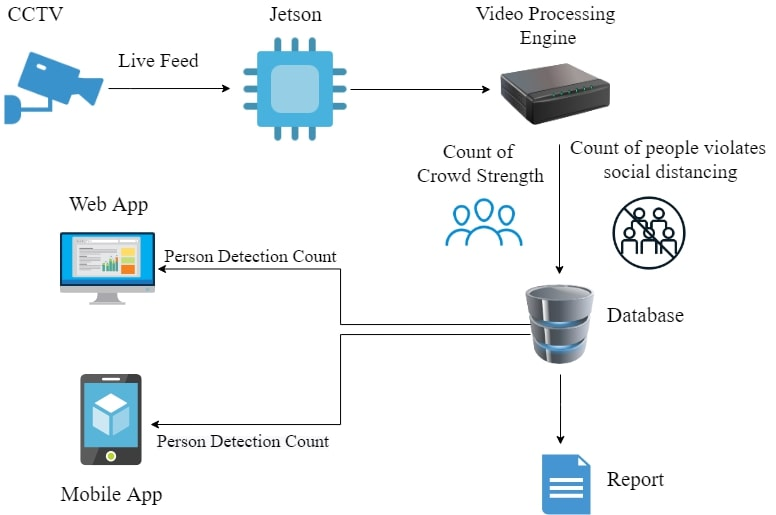
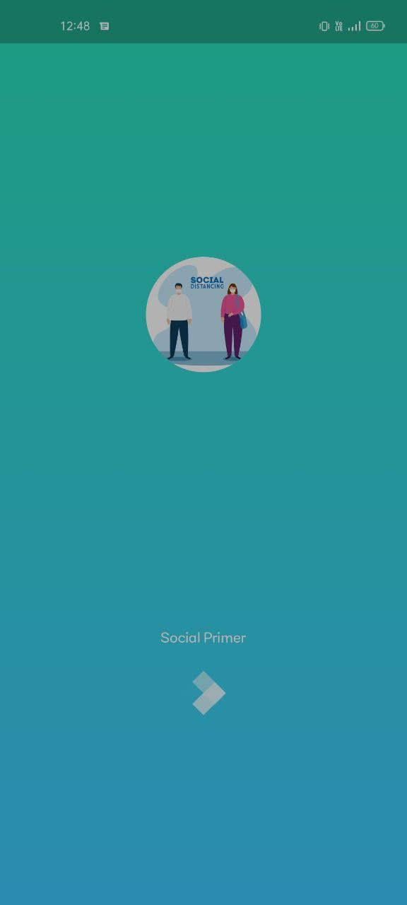
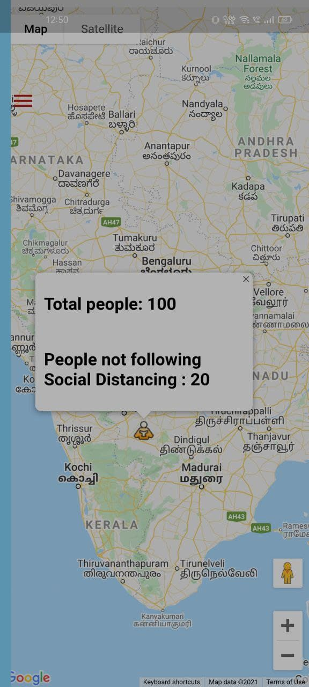
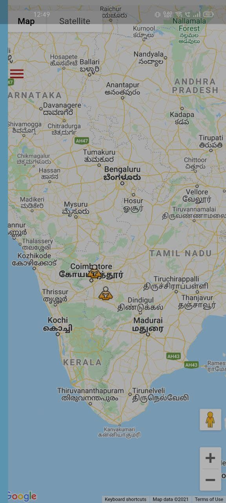

# *🦠 Social Primer 😷*

---

## Table of Contents

- [Description](#description)
- [Demo](#demo)

---

## Description
The outbreak of the novel coronavirus, COVID-19, has been declared a pandemic by the WHO. The corona virus spreads mainly happens through droplets produced by the direct close contact with coughing or sneezing of an infected person.
The social distancing is considered the best solution so far and however monitoring of the people still continues to be a difficult task for the governments and a frontline warrior as it is done manually.Using Social Primer we can automate the process using deep learning and update the status in the app which might be helpful for people to avoid crowded areas as well the organisations to control the crowd.

## Architecture

  

## Demo
App is developed using Flutter framework.
Code Available in Master branch

  
  
  

